# Streaming Architecture & Dataflow

## Pipeline Diagram

The `StreamingAutotuneEngine` processes audio buffers (chunks) through a causal, frame-by-frame pipeline.

```mermaid
graph LR
    Input[Audio Chunk] --> Tracker[Pitch Tracker / Mock]
    Tracker --> Decomposer[F0 Decomposition]
    Decomposer --> Segmenter[Voicing & Segmentation]
    Segmenter --> Reg[Baseline Regression]
    Reg --> Stab[Target Stabilizer]
    Stab --> Events[Event Scheduler / PFC]
    Events --> Recon[Reconstruction / Synthesis]
    Recon --> Output[Audio & Targets]
```

## Workload phases

### 1. Analysis (Tracker/Decomposer)
- **Input**: Raw Audio (Float32).
- **Output**: Pitch (Hz), Confidence (Q), Energy (dB).
- **State**: Deoptimization buffer, spectral history.

### 2. Tuning Logic (Segmenter -> Events)
- **Input**: Frame Analysis.
- **Output**: Corrected Target (Cents).
- **Constraint**: Must be 0-alloc per frame.
- **Components**:
  - **Segmenter**: Hysteresis for Voiced/Unvoiced state.
  - **Baseline**: Recursive Least Squares (RLS) for drift tracking.
  - **Stabilizer**: Quantization and note holding logic.
  - **Events**: Ring-buffer stored sparse modifications.

### 3. Synthesis (Reconstruction)
- **Input**: Corrected Target.
- **Output**: Processed Audio.
- **Note**: Currently stubbed/mocked in Phase 9 implementation.

## Determinism Contract

> **"Same audio + same chunking + same seed/config ⇒ identical output"**

The engine guarantees bit-exact reproducibility provided:
1. Input audio values are identical.
2. `chunkSize` remains constant (processing 128 samples at a time vs 1024 may yield slightly different internal state evolution if analysis windows align differently, though design aims for robustness).
3. Configuration and Events are identical.

## State Persistence

State is encapsulated in `ProsodyRuntimeStateV1`.
- **Persisted**: `segmenter` counts, `baseline` sums (X, Y, XY, XX), `stabilizer` latch state, `pfc` envelopes.
- **Reset**: Calling `reset()` clears all logical state but preserves configuration.

## Causal vs. Phrase-Final

- **Causal**: All standard processing is strictly causal (depends only on past and current frame).
- **Phrase-Final**: Not currently implemented in Streaming Engine. Any "future" knowledge must be injected via `Events` (which can be scheduled in advance).
